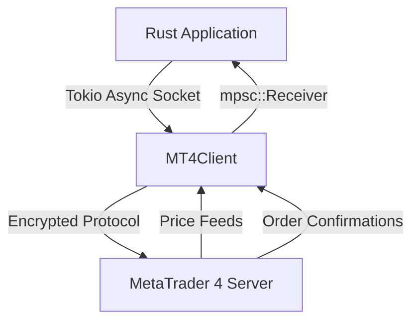

# RustMT4 SDK

Welcome to the **RustMT4 SDK** documentation. This high-performance asynchronous Rust crate connects directly to MetaTrader 4 servers without requiring a local desktop terminal or Wine.

## Key Features

- **Memory Safety & Performance**: Built purely in safe, modern Rust.
- **Asynchronous Tokio Engine**: Non-blocking channel streams for ticks and order responses.
- **Complete Order Lifecycle**: Market execution, pending limit/stop orders, SL/TP modify, and position closing.
- **Type-Safe Models**: Strongly typed structs and enums with Serde serialization.

## Architecture



## Quick Installation

Add to your `Cargo.toml`:

```toml
[dependencies]
metarpc-mt4 = { git = "https://github.com/MetaRPC/RustMT4.git" }
tokio = { version = "1.38", features = ["full"] }
```

See [Getting Started](getting-started.md) to build your first strategy.
